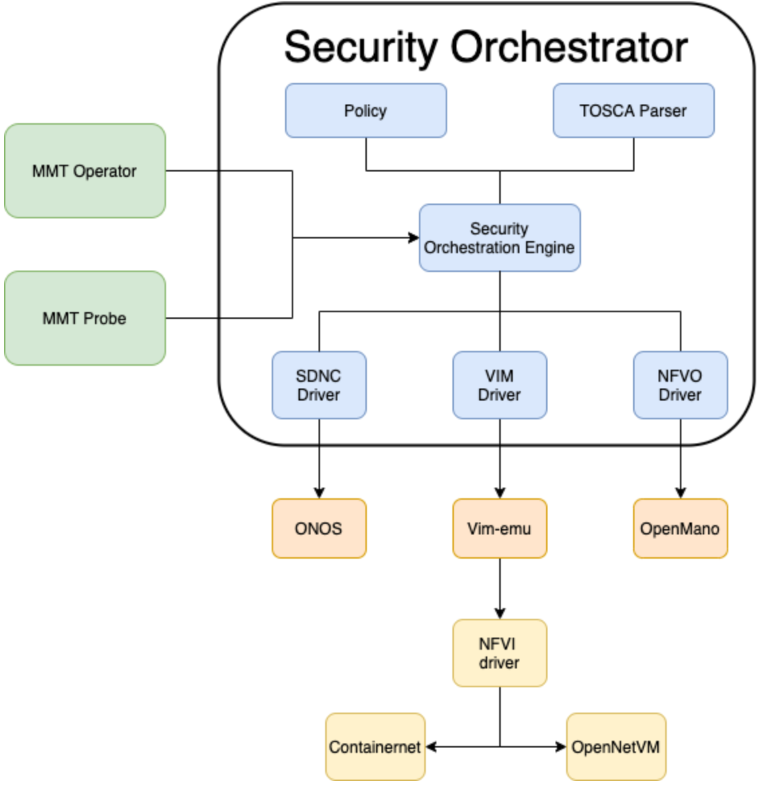

# Overview
The architecture of MANO follows the ETSI NFV MANO architecture, we only add a driver for each element that we integrate with. For example, for the NFVO, we create an OpenMANO driver, for the VIM we create a Vim-emu driver, for the SDNC we create an ONOS driver. So the idea is the security orchestrator can be compatible with any element, if we need to plug in another element, we can develop a new driver and replace the current driver. 

The following figure shows us the internal architecture of the security orchestrator. 



# Installation

Follow the instruction in the following link to install from scratch OpenMANO: https://osm.etsi.org/docs/user-guide/03-installing-osm.html 

To start openMANO, run the following command:


```
./install_osm.sh --vimemu
```


Follow the instruction in the following link to install from scratch OpenNetVM: https://github.com/sdnfv/openNetVM


To start the openNetVM:

```
./openNetVM/script/setup_environment.sh
```

Then to launch the openNetVM Manager:

```
cd ./openNetVM/
./onvm/go.sh 0,1,2 0 0xFFF8 -a 0x100000000 -s stdout
```

For the security orchestrator please install the following python libraries:

```
pip3 install docker
pip3 install --ignore-installed PyYAML
pip3 install flask
pip3 install Flask-Cors
```

To run the security orchestrator enter the mosaico_orchestrator and execute nfvo_server.py:

```
cd mosaico_mano/ ; python3 nfvo_server.py
```
